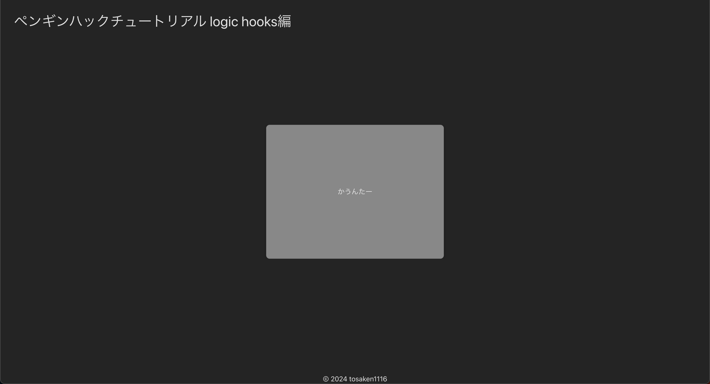

# 環境構築

## クローン
まずはリポジトリをクローンしましょう。

? クローンとは？
: リモートリポジトリをローカルにコピーすることです。

```bash
git clone https://github.com/tosaken1116/hooks-tutorial.git penguin-hack-hooks-tutorial
```

## パッケージインストール
ローカルにクローンしたリポジトリに移動し、必要なパッケージをインストールしましょう。

? パッケージとは？
: プログラムを実行するために必要なファイルや設定のことです。

```bash
cd penguin-hack-hooks-tutorial
npm install
```

## 起動
パッケージのインストールが完了したら、アプリケーションを起動しましょう。

```bash
npm run dev
```

これで、アプリケーションが起動されます。ブラウザで [http://localhost:5173](http://localhost:5173) にアクセスしてみましょう。

次のような画面が表示されれば成功です。



[次のステップに進む](https://github.com/tosaken1116/hooks-tutorial/blob/main/docs/2.md)
