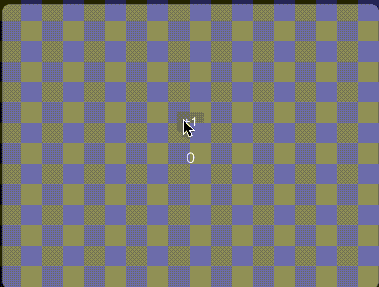

# useStateを使ってみよう

この章では、`useState`を使ってみます。

## Counterを作る

まずは、`useState`を使ってCounterを作ってみましょう。

`src/components/Counter.tsx`を作成し、以下のように書いてみましょう。

```tsx
import { useState } from "react";

export const Counter = () => {
  const [count, setCount] = useState(0);
  return (
    <div>
      <button onClick={() => setCount(count + 1)} type="button">
        +1
      </button>
      <p>{count}</p>
    </div>
  );
};
```

`useState`は、初期値を引数に取り、配列で返します。返された配列の1番目の要素は、現在の値、2番目の要素は、値を更新する関数です。

`count`は現在の値、`setCount`は値を更新する関数です。

`<button>`をクリックすると、`count`の値が1増えます。

画面が表示されたら、`+1`ボタンをクリックしてみましょう。

次のようにカウントが更新されたら成功です。


## stateと変数の違い

`useState`で作成した`count`は、通常の変数とは異なります。

試しに先ほどのCounterを次のように編集してみましょう


```diff
- import { useState } from "react";

export const Counter = () => {
-  const [count, setCount] = useState(0);
  let count = 0;
  return (
    <div>
-      <button onClick={() => setCount(count + 1)} type="button">
+      <button onClick={() => count++} type="button">
        +1
      </button>
      <p>{count}</p>
    </div>
  );
};
```

`useState`を使わずに、通常の変数を使ってカウントを増やしてみましょう。

変数の仕組み上、countは更新されるため、画面にはカウントが増えるように見えます。

しかし、実際にはカウントが増えていません。

reactは、`useState`で作成した変数の変更を検知し、画面を更新します。

つまり、stateを使わないと、画面が更新されないということです。

(次のようにボタンを押しても、カウントが増えません)




## まとめ
reactにおいて画面の再描画をする場合はstateが必須です。

`useState`を使うことで、stateを作成することができます。

とりあえず画面の更新をしたいならuseStateを使うということさえ覚えておけば大丈夫です。


[次のステップに進む](https://github.com/tosaken1116/hooks-tutorial/blob/main/docs/3.md)