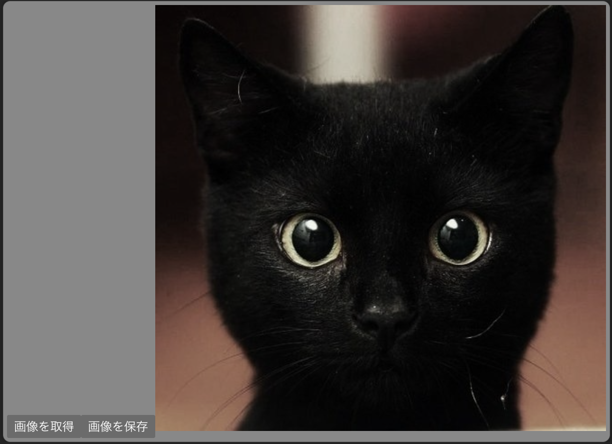
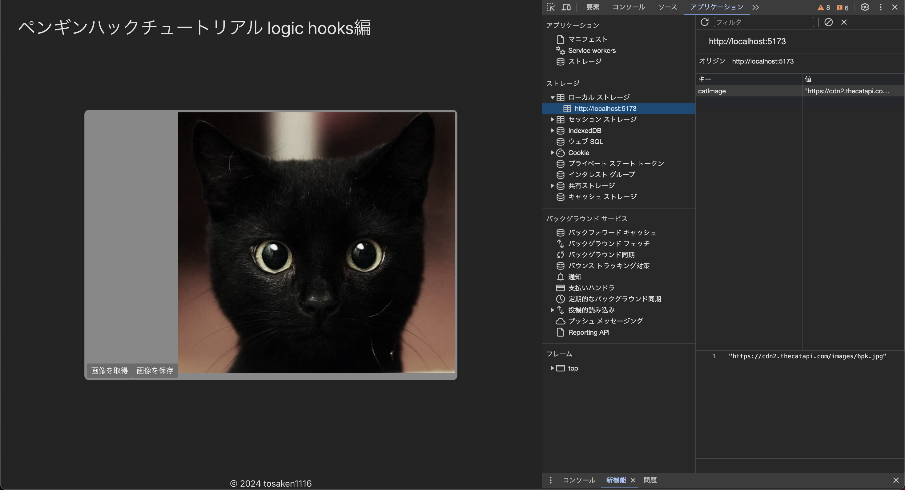

# お気に入り機能を作る
この章では、お気に入り機能を作ります。お気に入り機能とは、ユーザーが気に入った画像を保存しておく機能です。お気に入り機能を作ることで、ユーザーが気に入った画像を後から見返すことができるようになります。

## お気に入り保存機能の実装

お気に入り機能を実装するために、まずはお気に入り保存機能を作ります。お気に入り保存機能は、ユーザーが気に入った画像を保存する機能です。お気に入り保存機能を作るためには、お気に入り保存ボタンを作り、そのボタンが押されたときにお気に入り保存処理を行う必要があります。

まずはお気に入りに保存するためのロジックを作ります

今回はlocalStorageを使ってお気に入り保存機能を実装します。

?localStorageとは?
localStorageは、ブラウザにデータを保存するための仕組みです。localStorageを使うことで、ブラウザを閉じても保存したデータを保持することができます。

今回はlocalStorageを使うためのカスタムフック`useLocalStorage`を作ります。

`src/hooks/useLocalStorage.ts`を以下のように作成します。

```ts
export const useLocalStorage = (key: string) => {
  const get = () => {
    const item = localStorage.getItem(key);
    return item ? JSON.parse(item) : null;
  };
  const set = (value: any) => {
    localStorage.setItem(key, JSON.stringify(value));
  };
  return { get, set };
};
```

`useLocalStorage`は、`get`と`set`を返す関数です。

`get`は、localStorageからデータを取得するための関数です。

`set`は、localStorageにデータを保存するための関数です。

これを使って、お気に入り保存機能を作ります。

## お気に入り保存ボタンを作る

`src/hooks/useCatImages.ts`を以下のように編集します。

```diff
import { useEffect, useState } from "react";
+import { useLocalStorage } from "./useLocalStorage";

export const useCatImages = () => {
  const [imgSrc, setImgSrc] = useState("");
+  const { get, set } = useLocalStorage("catImage");
+  const [savedImageSrc, setSavedImageSrc] = useState(get() || []);
  const handleFetch = () => {
    fetch("https://api.thecatapi.com/v1/images/search").then((res) => {
      res.json().then((data) => {
        setImgSrc(data[0].url);
      });
    });
  };
+  const handleSave = () => {
+    set(imgSrc);
+    setSavedImageSrc(imgSrc);
+  };
  useEffect(() => {
    handleFetch();
  }, []);
-  return { imgSrc, handleFetch };
+  return { imgSrc, handleFetch, savedImageSrc, handleSave };
};

```

`src/components/Counter.tsx`を以下のように編集します。

```diff
import { useCatImages } from "../hooks/useCatImages";
export const Button = () => {
  const { imgSrc, handleFetch,handleSave } = useCatImages();
  return (
    <div>
      <button onClick={handleFetch} type="button">
        画像を取得
      </button>
+      <button
+        onClick={handleSave}
+        type="button"
+      >
+        画像を保存
+      </button>
      
    </div>
  );
};
```

次のようになれば成功です。



`画像を保存`ボタンをクリックすると、画像が保存されます。

開発者ツールの`Application`タブを開いて、`localStorage`を確認してみましょう。

確認の仕方

1. ブラウザを開く
2. 開発者ツールを開く(`F12`キーを押す)
3. `Application`タブを開く
4. `localStorage`を開く
5. `https://localhost:5173`を開く
6. `catImage`のデータが保存されていることを確認する

次のように`catImage`のデータが保存されていれば成功です。



## お気に入り画像を表示する

お気に入り画像を表示するために、`src/components/Counter.tsx`を以下のように編集します。

```diff
import { useCatImages } from "../hooks/useCatImages";
import { useLocalStorage } from "../hooks/useLocalStorage";

export const Button = () => {
-  const { imgSrc, handleFetch } = useCatImages();
+  const { imgSrc, savedImgSrc, handleFetch } = useCatImages();
  return (
    <div>
      <button onClick={handleFetch} type="button">
        画像を取得
      </button>
      <button
        onClick={() => {
          set(imgSrc);
        }}
        type="button"
      >
        画像を保存
      </button>
+      {savedImgSrc && }
      
    </div>
  );
};
```

`画像を保存`ボタンをクリックし、画面をリロード(ctrl+R)した時に、保存した画像が表示されれば成功です。


## お気に入り画像を複数枚保存する

お気に入り画像が一枚しか保存できないのは不便です。お気に入り画像を複数枚保存できるようにしましょう。

`src/hooks/useCatImages.ts`を以下のように編集します。

```diff
import { useEffect, useState } from "react";
import { useLocalStorage } from "./useLocalStorage";

export const useCatImages = () => {
  const [imgSrc, setImgSrc] = useState("");
-  const { get, set } = useLocalStorage("catImage");
+  const { get, set } = useLocalStorage("catImages");
  const [savedImageSrc, setSavedImageSrc] = useState(get() || []);
  const handleFetch = () => {
    fetch("https://api.thecatapi.com/v1/images/search").then((res) => {
      res.json().then((data) => {
        setImgSrc(data[0].url);
      });
    });
  };
  const handleSave = () => {
-    set(imgSrc);
-    setSavedImageSrc(imgSrc);
+    if(savedImageSrc.includes(imgSrc)) {
+      return;
+    }
+    set([...(savedImageSrc || []), imgSrc]);
+    setSavedImageSrc(get() || []);
  };
  useEffect(() => {
    handleFetch();
  }, []);
  return { imgSrc, handleFetch, savedImageSrc, handleSave };
};
```

`src/components/Counter.tsx`を以下のように編集します。

```diff
import { useCatImages } from "../hooks/useCatImages";

export const Button = () => {
  const { imgSrc, handleFetch, savedImageSrc, handleSave } = useCatImages();
  return (
    <div>
      <button onClick={handleFetch} type="button">
        画像を取得
      </button>
      <button onClick={handleSave} type="button">
        画像を保存
      </button>
-      {savedImgSrc && }
+      {savedImageSrc && (
+        <>
+          {savedImageSrc.map((src: string) => (
+            
+          ))}
+        </>
+      )}
      
    </div>
  );
};
```

`画像を保存`ボタンをクリックし、画面をリロード(ctrl+R)した時に、保存した画像が複数枚表示されれば成功です。


## お気に入り画像を削除する

お気に入り画像を削除するために、`src/hooks/useCatImages.ts`を以下のように編集します。

```diff
import { useEffect, useState } from "react";
import { useLocalStorage } from "./useLocalStorage";

export const useCatImages = () => {
  const [imgSrc, setImgSrc] = useState("");
  const { get, set } = useLocalStorage("catImages");
  const [savedImageSrc, setSavedImageSrc] = useState(get() || []);
  const handleFetch = () => {
    fetch("https://api.thecatapi.com/v1/images/search").then((res) => {
      res.json().then((data) => {
        setImgSrc(data[0].url);
      });
    });
  };
  const handleSave = () => {
    if (savedImageSrc.includes(imgSrc)) {
      return;
    }
    set([...(savedImageSrc || []), imgSrc]);
    setSavedImageSrc(get() || []);
  };
+  const handleDelete = (index: number) => {
+    const newSavedImageSrc = savedImageSrc.filter((_, i) => i !== index);
+    set(newSavedImageSrc);
+    setSavedImageSrc(newSavedImageSrc);
+  };
  useEffect(() => {
    handleFetch();
  }, []);
  return { imgSrc, handleFetch, savedImageSrc, handleSave, handleDelete };
};
```

`src/components/Counter.tsx`を以下のように編集します。

```diff
import { useCatImages } from "../hooks/useCatImages";


export const Counter = () => {
  const { imgSrc, handleFetch, savedImageSrc, handleSave, handleDelete } = useCatImages();
  return (
    <div>
      <button onClick={handleFetch} type="button">
        画像を取得
      </button>
      <button onClick={handleSave} type="button">
        画像を保存
      </button>
      {savedImageSrc && (
        <>
          {savedImageSrc.map((src: string, index: number) => (
            <div key={src}>
              
              <button onClick={() => handleDelete(index)} type="button">
                画像を削除
              </button>
            </div>
          ))}
        </>
      )}
      
    </div>
  );
};
```

`画像を保存`ボタンをクリックし、、保存した画像が複数枚表示され、`画像を削除`ボタンをクリックすると、画像が削除されれば成功です。

## まとめ

お気に入り機能を作ることができました。

お気に入り機能を作ることで、ユーザーが気に入った画像を保存しておくことができるようになりました。

[次のステップに進む](https://github.com/tosaken1116/hooks-tutorial/blob/main/docs/7.md)
